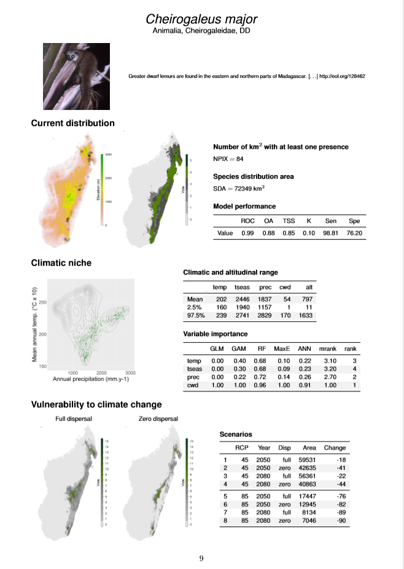

# speciesatlas

# Producing an atlas of the biodiversity for a given area and for given species.

## Using the package 

To use this package, you must have :

- a list of dataFrames containing your data. Each dataFrame stands for a taxon and must contains at least these columns with the exact same names : `Species` (name of the specie), `Long` (Longitude), `Lat` (Latitude) and `Taxo.group` (name of the taxon).
- a RasterStack containing environmental data about the area you want to study. It has to contain an `alt` column, and 4 others columns with parameters you want to run the study on.
- a list of RasterStacks with environmental datas about the future, according to several climate scenarios. In this order, your list must contain the different years, afterthat the different rcp scenarios and finally the different climate models. Every RasterStack must contain the same variables as the RasterStack for the present.
- your API Keys in an .Renviron file at the root of your computer. More informations at <https://ropensci.github.io/taxize-book/authentication.html>
- a directory called `maxent` containing the file `maxent.jar`

There are more information about how to use the package in the description files `fun.main.Rd` and `Ratlas-package.Rd`.

## Results

The area we tested the package is Madagascar and the taxons are **Lemurs** and **Baobabs**. We obtain one atlas page for every specie, in the PDF or Bookdown format.

## Licence

The package is available under the GNU General Public License version 3 (see `LICENSE` file).
