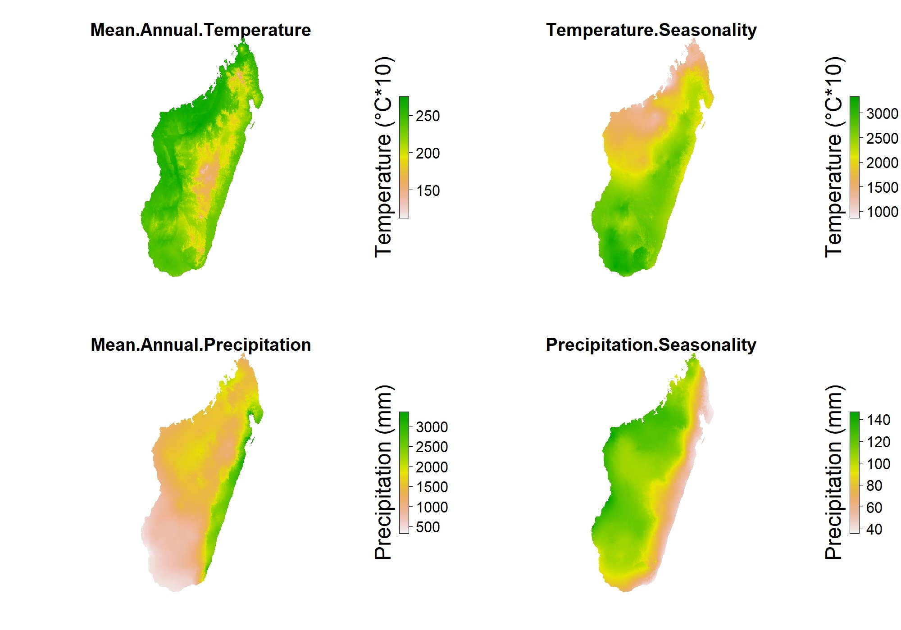
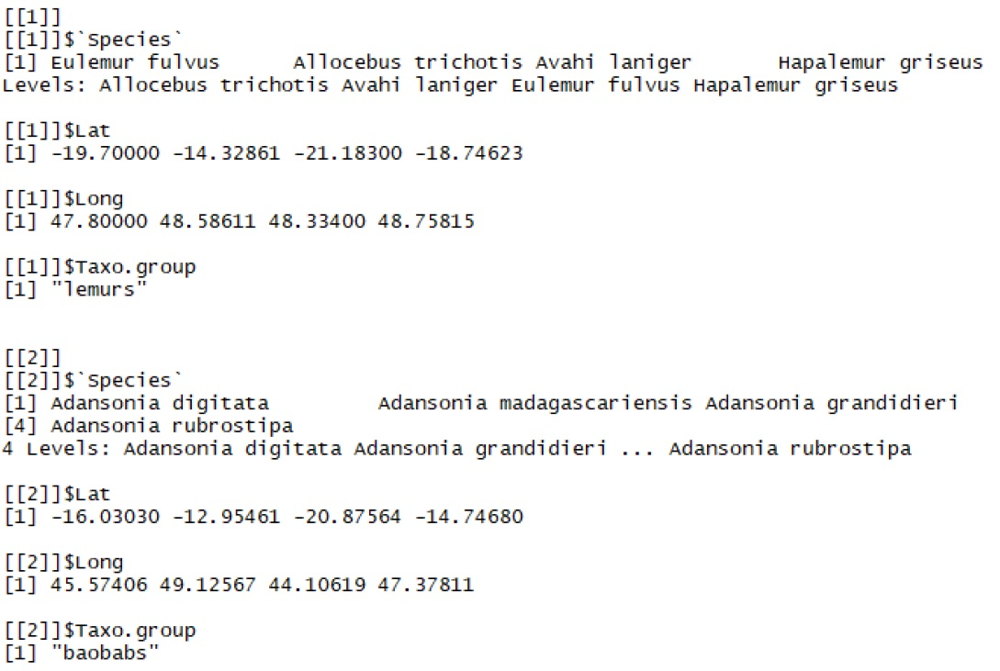

```{r setup, include=FALSE}
knitr::opts_chunk$set(
  fig.align = "center",
  fig.width = 6, fig.height = 6,
  cache = FALSE,
  collapse = TRUE,
  comment = "#>",
  highlight = TRUE,
  tidy.opts=list(width.cutoff=70),
  tidy=TRUE
)
```

```{r, results='asis',echo=FALSE, eval=("bookdown::pdf_document2" %in% rmarkdown::all_output_formats(knitr::current_input()))}
cat('\\newpage')
```

# Introduction

Species Distributions Models (SDMs) are widely used to model species habitat using occurences and environmental data. Recently, SMDs have been used to investigate the effect of climate change on species distribution. When used in this context, being able to quantify uncertainities becomes an important matter. To adress this issue we propose a framework allowing to work easily with 5 differents statistical models, as well as different climatic models, scenarios and species' dispersion capabilties. Changes in species' habitats are useful information for reserve managers but are, unfortunately, difficult to obtain without the required skills. This package aims to ease the acess to such informations. 

In this vignette we will showcase the use of the `speciesatlas` R package which allows to create synthetic sheet assessing species vulnerability to climate change. It also generates community level maps of climate refuge areas for biodiversity. SMDs are modelled using the `Biomod2` package in an ensemble modelling framework. The package takes advantage of multithreading to enhance performances.  

Here we show an example of the use of `speciesatlas`, illustrating how to format the data prior to the analyses, how to view the outputs and how to get the resulting figures. 


```{r, results='asis',echo=FALSE, eval=("bookdown::pdf_document2" %in% rmarkdown::all_output_formats(knitr::current_input()))}
cat('\\pagebreak')
```

# Data-set

For this example we will use a subset of the data-set compiled by @brown_yoder_2015 for Madagascar's most endemic taxonomic group : lemurs. This sample consists of 355 observations points belonging to 4 differents species. Data points come from a wide range of sources and can be viewed in the original article. 

```{r echo=FALSE, out.width="80%", fig.cap="Left : Babakoto (Indri indri), ref: Frank Vassen. Right : Indri Indri's observations",fig.show='hold', fig.align = "default"}
knitr::include_graphics("../img/babakoto_var.jpg")
```

In order to modele current and future species distributions, we will use present climatic data come from @fick_hijmans_2017 (WorldClim) and predictions from @ccafs-climate. To simplify the process we will only use 4 differents variables :

* Mean Annual emperature (MAT)
* Temperature Saisonality (TSeas)
* Mean Annual Precipitation (MAP)
* Precipitation Saisonality (PSeas)

```{r echo=FALSE, out.width="70%", fig.cap="Map for each illustration. From top-left to bottom-right : "}

```

In order to reduce computing time to produce the predicted distribution, we will use only use :

* three climatic models : CCSM4 (CC), GISS-E2-R (GS) and HadGEM2-ES (HE) ; 
* one scenarios : rcp 8.5 ; 
* one time period : 2085

All the data have been downloaded at a 30' spatial resolution and projected in the desired projection system and resolution (here epsg:32738, 1-km$^2$).

```{r, results='asis',echo=FALSE, eval=("bookdown::pdf_document2" %in% rmarkdown::all_output_formats(knitr::current_input()))}
cat('\\pagebreak')
```

## Formating climatic data
We first load the `raster` package in order to prepare the climatic data.

```{r libraries, eval = FALSE}
# Load libraries
library(raster)
library(speciesatlas)
```


The climatic data are available within the `speciesatlas` R package. For present data, it can be loaded as follow :

```{r World Clim, eval = FALSE}
# Figuring out the path to the data
path.data <- system.file("extdata", package = "speciesatlas")

# Loading data from WorldClim
present <- brick(paste0(path.data,"/current.tif"))
# Renaming variables of interest
names(present) <- c(paste0("current",1:36),"temp",paste0("current",38:39),"tseas",
                    paste0("current",41:47),"prec","bioclim1",
                    "bioclim2","pseas",paste0("current",52:67),"pet","cwd","ndm")
# Transform from RasterBrick to Rastertack
present <- stack(present) 
```

Informations regarding models, scenarios and time periods must be stored in a vector, such as the one in the next example.

```{r vector-climate, eval = FALSE}
# First we provide information about the model, scenarios and years we want to use 
fut.var <- list(c("cc","he","gs"),c("85"),c("2085"))
```

Rasters for future climatic predictions should be stored in a list, using this structure :

* Scenario1_timeperiod1
    + model1
    + model2
    + model3
    + etc...
* Scenario1_timeperiod2
    + ...
* Scenario2_timeperiod1
    + ...
* ...

This code may help you setup such a list :
```{r ccafs-climate, eval = FALSE}
# First we provide information about the model, scenarios and years we want to use 
fut.var <- list(c("cc","he","gs"),c("85"),c("2085"))
# Empty vector to stock raster list
future <- vector("list")
i.mod <- 1

#And then we load each file
#First by looping through differents scenarios:
for (j in 1:length(fut.var[[2]])) {
  #Then through the years :
  for (l in 1:length(fut.var[[3]])) {
    future[[i.mod]] <- vector("list")
    #Finally by loading 3 climatic models for each years and scenarios:
    for (mc in 1:length(fut.var[[1]])) {
      future[[i.mod]][[mc]] <- stack(paste0(path.data,"/",fut.var[[1]][mc],"_",fut.var[[2]][j],"_",fut.var[[3]][l],".tif"))
      names(future[[i.mod]][[mc]]) <- c(paste0("current",1:36),"temp",paste0("current",38:39),"tseas",paste0("current",41:47),"prec","bioclim1",
                                        "bioclim2","pseas",paste0("current",52:67),"pet","cwd","ndm")
      future[[i.mod]][[mc]] <- stack(future[[i.mod]][[mc]])
    }
    i.mod <- i.mod+1
  }
}

```

Note that scenarios and time periods within the list should follow the same order as in the `fut.var` variables. 
There is no need to normalize the data as the package takes care of it. 

## Formating presences points

Secondly, we need to load the presence points. `speciesatlas` works by aggregating each species results at a community level, corresponding to a given taxonomic group. Here we only work with lemurs, but more taxonomic group may be added on a same run. Altough, be aware that doing so means that the same climatic variables will be used for the differents taxonomic groups. 

Presence data are stored in a list using this structure :
```{r echo=FALSE, out.width="70%", fig.cap="Structure used for the presences points"}

```

The following code may help you build such a list. Here, each taxonomic group must be in a single text file, named after the group, with three columns (scientificname, decimalLat, decimalLong), separated with a semicolon. Coordinates are kept in the World Geodetic System (epsg:4326).

```{r Brown2009, eval = FALSE}
#First we select the taxonomic groups we want to modele 
taxon.names <- c("lemurs")
#We then create an empty list
df.orig <- vector("list", length = length(taxon.names))

#And we loop through the different file to gather the informations
for (sp in 1:length(taxon.names)){
  taxon <- read.csv(file=paste0(path.data,"/",taxon.names[sp],".txt"),header=TRUE,sep=";")
  df.orig[[sp]]$Species <- taxon$scientificname
  df.orig[[sp]]$Lat <- taxon$decimalLat
  df.orig[[sp]]$Long <- taxon$decimalLong
  df.orig[[sp]]$Taxo.group <- taxon.names[sp]
}
```

# Setting parameters & starting the package

`speciesatlas` allows for differents parts of its algorithm to be run or not. This allows to rerun some parts without starting from scratch again. Please note that each part should be run at least once before being disabled. 

```{r run, eval = FALSE}
#True by default
run.models <- T
run.plots <- T
run.taxo <- T
run.map <- T
```

Then we need to select which variables will be used for the modelisation :

```{r variable_selection, eval = FALSE}
model.var <-  c("temp","tseas","prec","pseas")
```

By default, `speciesatlas` uses the maximun number of cores available minus one. You may overwrite this behaviour by setting the n.cores paramaters to any values lesser than `parallel::detectCores()-1`:

```{r core_selectioneval = FALSE, eval = FALSE}
#Here we only use two cores
n.core <- 2
```

Finally, we need to set the book title, authors and chose the output type between "pdf", "html" or "both" :

```{r output, eval = FALSE}
out.type <- "both"
title.book <- "A Good Title"
author.book <- "John Doe & John Smith"
```

Once everything is set, it's time to run the package. This may take a while :

```{r starting, eval = FALSE}
fun.main(df.orig,run.models,run.plots,run.taxo,run.map,model.var,environ,future,fut.var,maxent.path,n.core,out.type,title.book,author.book)
```

```{r, results='asis',echo=FALSE, eval=("bookdown::pdf_document2" %in% rmarkdown::all_output_formats(knitr::current_input()))}
cat('\\pagebreak')
```

# Results

# Atlas Outputs

# References